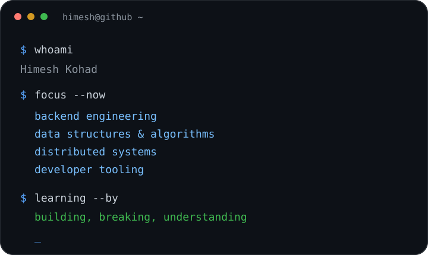

<div align="center">


<br>


</div>

---

## 👋 About Me

<table>
<tr>
<td width="55%" valign="middle">

### Hey, I'm Himesh.

I'm a **System Engineer** interested in **backend engineering, Data Structures & Algorithms, and software systems**.

I enjoy going beyond *"it works"* and understanding **why it works** — how data moves through a system, how algorithms make decisions, how components interact, and what happens underneath the abstractions we normally take for granted.

My current focus is **Python**, which I'm using to strengthen my fundamentals, build backend-oriented software, and explore concepts across **APIs, databases, concurrency, system design, and developer tooling**.

I'm also working through **DSA consistently**, with an emphasis on understanding the reasoning behind a solution rather than memorizing patterns or code.

This GitHub is where I document that process through **projects, experiments, algorithms, and things I'm learning along the way.**

<br>

> **Understand the fundamentals. Build with them. Go deeper.**

</td>

<td width="45%" align="center">



</td>
</tr>
</table>

---

## 🧭 Currently Exploring

<div align="center">

<table>
<tr>
<td align="center" width="25%">

### 🧠

**Algorithms**

DSA · Dynamic Programming
Problem Solving · Patterns

</td>

<td align="center" width="25%">

### ⚙️

**Backend Engineering**

Python · APIs
Databases · System Design

</td>

<td align="center" width="25%">

### 🤖

**AI Engineering**

LLMs · AI APIs
RAG · AI-assisted Development

</td>

<td align="center" width="25%">

### 🛠️

**Engineering Foundations**

Concurrency · Networking
Linux · Docker · PostgreSQL

</td>
</tr>
</table>

</div>

---

## ⚡ Tech Stack

<div align="center">

### Languages


<br><br>

### Backend · Data · Systems


<br><br>

### Web · Tools


<br><br>


</div>

---

## 🧩 How I Learn

<div align="center">

<table>
<tr>
<td align="center" width="33%">

### 01 · Understand

**Start with the fundamentals.**

Understand the problem,
the abstraction, and the
reasoning behind it.

</td>

<td align="center" width="33%">

### 02 · Build

**Turn concepts into code.**

Experiment, implement,
break things, debug them,
and see what actually happens.

</td>

<td align="center" width="33%">

### 03 · Go Deeper

**Don't stop at the first answer.**

Explore trade-offs,
alternatives, complexity,
and what happens underneath.

</td>
</tr>
</table>

</div>

---

<div align="center">

### `Curiosity → Fundamentals → Code → Understanding`

</div>

---

## 📚 What I'm Working Toward

<div align="center">

<table>
<tr>
<td align="center" width="50%">

**Strong Computer Science Fundamentals**

Data Structures · Algorithms
Operating Systems · Networking
Databases · System Design

</td>

<td align="center" width="50%">

**Stronger Software Engineering**

Backend Development · APIs
Concurrency · Distributed Systems
Developer Tools · AI Engineering

</td>
</tr>
</table>

</div>

---

## 🌱 A Little More

```text
┌──────────────────────────────────────────────────────────────┐
│                                                              │
│   I like knowing what's under the hood.                      │
│                                                              │
│   Not just what the code does —                              │
│   but why it works, how it works,                            │
│   and what happens when it doesn't.                          │
│                                                              │
└──────────────────────────────────────────────────────────────┘
```

---

<div align="center">

<a href="mailto:himeshkohad.work@gmail.com">
  
</a>
&nbsp;
<a href="https://www.linkedin.com/in/himeshkohad/">
  
</a>
&nbsp;
<a href="https://leetcode.com/u/HimeshKohad/">
  
</a>

<br><br>


</div>
